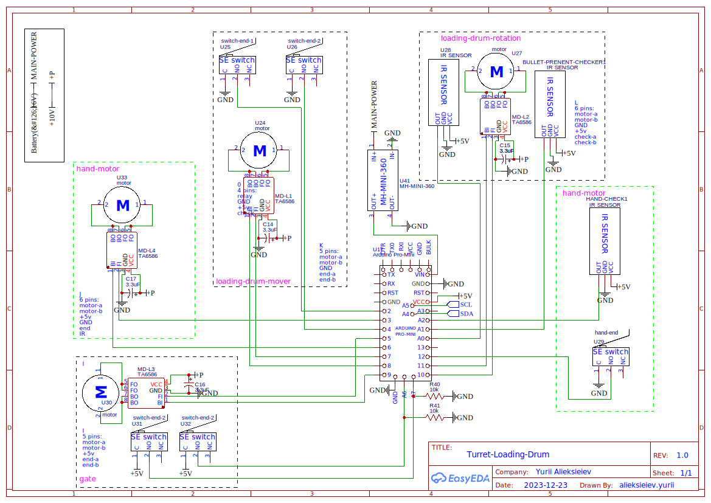

# Loading Drum

The module is responsible for loading shells into the breechblock.
The whole logic is build using state machine approach. The module is communication by I2C.
Before running commands, calibration must be done. To do that, send 0x01 command.
Command - is a single byte send to the module. Once the command is send, it starts executing.
The output states changes to _doing_(0x1). Later, the status changes to _done_(0x2) or _failed_(0x3).
After that, youhave to reset status by sending 0x0 command. After that you can send other commands.

## Electronic Circuit

## Commands Table

| Command |                                      Description                                               |
|---------|------------------------------------------------------------------------------------------------|
|  0x00   | Reset status. Must be called after each command                                                |
|  0x01   | Performs the calibration and _unlocks another commands_                                        |
|  0x02   | Connect (move in) the loader with the breechblock                                              |
|  0x03   | Disconnect (move out) the loader with the breechblock                                          |
|  0x04   | Load the breechblock. Looks for non-empty cell in clockwise manner. Will fail if not shells    |
|  0x05   | Finish loading -> pulls the feeder and close the gate                                          |
|  0x06   | Unload the breechblock. If current cell is empty, will look for empty cell in counterclockwise manner, then opens the gate and pulls out the shell. Then checks if the shell is in the drum and closes the gate. |
|  0x07   | Clockwise rotation of the drum.                                                                |
|  0x08   | Counterclockwise rotation of the drum.                                                         |
|  0x09   | Open the drum gate.                                                                            |
|  0x0A   | Close the drum gate.                                                                           |
|  0x0B   | Push the feeder.                                                                               |
|  0x0C   | Pull the feeder.                                                                               |
|  0x0D   | Falcify calibration (Use only during debug or in unusual cases)                                |

## Output

The response from the module is one byte. The first 3 bits represents the execution status.
The following table describes the statuses:

| Status |                 Description               |
|--------|-------------------------------------------|
|  0x0   | Idle. Means you can send commands         |
|  0x1   | Command execution is in progress          |
|  0x2   | Command execution is finished successfuly |
|  0x3   | Command execution is failed               |

The next 4 bits represents code errors. The code error appears only if the execution status is failed.
The following table describes the code errors:

|  Code  |             Description                   |
|--------|-------------------------------------------|
|  0x0   | No code error                             |
|  0x1   | Calibration required                      |
|  0x2   | Gate opening timeout                      |
|  0x3   | Gate closing timeout                      |
|  0x4   | Connection loading drum timeout           |
|  0x5   | Disconnection loading drum timeout        |
|  0x6   | Feeder push timeout                       |
|  0x7   | Feeder pull timeout                       |
|  0x8   | Drum clockwise rotation timeout           |
|  0x9   | Drum counter clockwise rotation timeout   |
|  0xA   | No shells to load                         |
|  0xB   | No empty sell to unload the breechblock   |
|  0xC   | Couldn't pull the shell                   |

